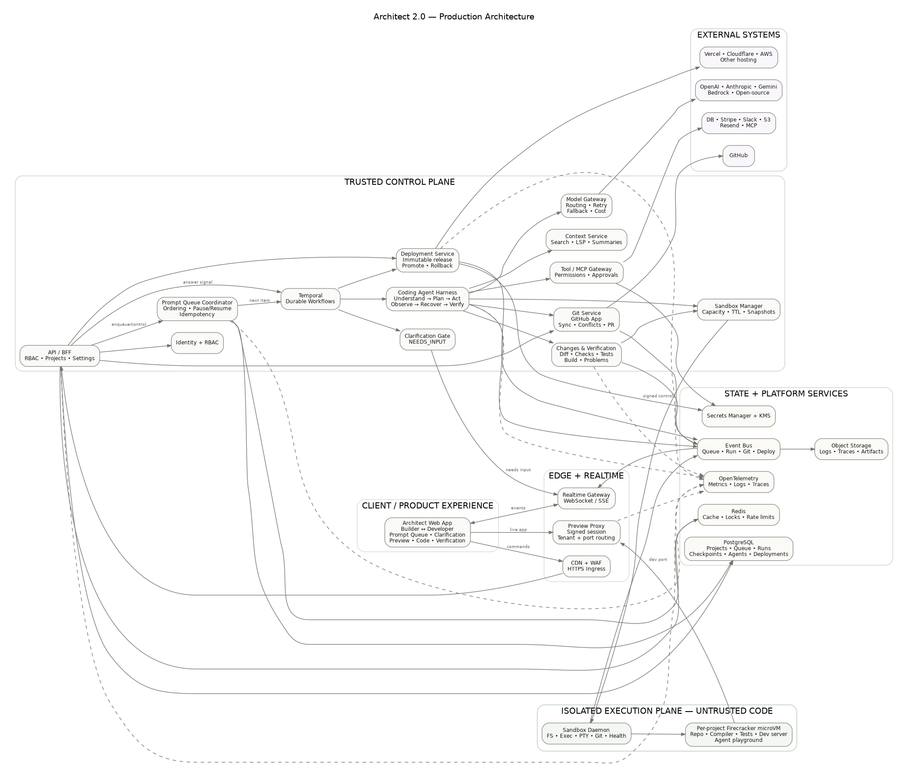

# Architect 2.0 — Technical Architecture

**Revision:** 28 September 2026  
**Live prototype:** https://architect-two-workspace.shreyashdubeymail.chatgpt.site

> The hosted site is an interactive UX/product prototype. Browser/local state is used for demo persistence, while coding execution, GitHub writes, sandbox operations, model/tool calls, agent runs, and generated-app deployments are represented as realistic product flows. This document describes how those flows should be implemented in a production system.

---

# 1. Product thesis

Architect 2.0 is a vibe-coding workspace for two audiences:

- non-technical builders who want to go from idea to working product without managing code;
- professional developers who need source-level precision, runtime visibility, Git control, testing, traces and deployment depth.

The core decision is:

> **One workspace, two depths.**

Architect does not create separate “easy” and “advanced” products.

**Builder mode** emphasizes:

- prompting;
- Prompt Queue;
- plan/progress;
- live preview;
- integrations;
- checkpoints;
- deployment.

**Developer mode** operates on the exact same project and run state but progressively reveals:

- editable source;
- file tree;
- Git;
- terminal;
- logs;
- tests;
- problems;
- model/framework controls;
- agent traces;
- diffs;
- verification;
- deployment detail.

The mode switch is therefore a presentation and control-depth change, not a project migration.

---

# 2. Latest product capabilities represented in the prototype

The final prototype covers:

1. authentication/onboarding;
2. project home and project creation;
3. GitHub repository import;
4. prompt-driven building;
5. multi-prompt **Prompt Queue**;
6. queue pause/resume/remove/clear;
7. **Needs input** clarification state;
8. live application preview;
9. visual element targeting;
10. Builder ↔ Developer mode switching;
11. editable developer workspace;
12. file/diff inspection;
13. terminal/log/tests/problems;
14. Changes & Verification;
15. Apply/Revert;
16. checkpoints and restore;
17. Agent Studio;
18. framework/model/tool/trigger/memory configuration;
19. agent execution traces;
20. agent playground;
21. integrations/secrets concepts;
22. GitHub branch/sync/conflict/PR flows;
23. deployment environment/region/build/logs/history;
24. promote and rollback;
25. neumorphic, mode-aware UI with distinct Builder and Developer states.

---

# 3. Architecture principles

## 3.1 Never execute untrusted generated code in the trusted application backend

AI-generated/user code executes only inside isolated sandboxes.

## 3.2 Long-running agent work must be durable

A coding run may:

- take minutes;
- execute many commands;
- wait for an external API;
- restart a sandbox;
- retry a model provider;
- pause for human clarification;
- wait while the browser is closed.

It therefore cannot be modeled as one HTTP request.

## 3.3 Prompt Queue is a backend primitive

Queue ordering and state cannot exist only in React state. It must be durable, transactional and recoverable.

## 3.4 Builder and Developer modes share the same source of truth

Mode changes do not fork project state.

## 3.5 Models must be replaceable

The rest of Architect should not depend on one model provider SDK.

## 3.6 Verification is part of execution

A generated change is not complete merely because the model stopped. The platform should expose whether it builds, tests and runs.

## 3.7 Production deployments must be immutable

Production should deploy from a selected checkpoint, commit or content digest, not from an arbitrary mutable interactive sandbox.

---

# 4. High-level architecture



Editable diagram source: [`architecture.mmd`](architecture.mmd)  
Vector render: [`architecture.svg`](architecture.svg)

The platform is separated into two trust zones.

## Trusted control plane

Owns:

- authentication and authorization;
- projects/workspaces;
- Prompt Queue;
- workflow orchestration;
- model routing;
- tool permissions;
- GitHub metadata/actions;
- secrets references;
- deployment state;
- billing/usage;
- realtime events.

## Isolated execution plane

Runs:

- repository source;
- package installs;
- user code;
- generated code;
- dev servers;
- build/test commands;
- terminals;
- app-agent playground execution.

The execution plane never connects directly to the control-plane database.

---

# 5. Web application

**Recommended stack:** Next.js + React + TypeScript.

The frontend includes:

- sign-in/onboarding;
- project home;
- Builder / Developer toggle;
- Prompt Queue;
- clarification UI;
- build activity;
- live preview;
- visual inspect mode;
- editable file/code workspace;
- Changes & Verification;
- terminal/log/tests/problems;
- Agent Studio;
- GitHub;
- deployment;
- settings;
- collaboration;
- usage.

The browser communicates with:

1. **API/BFF** for commands and metadata;
2. **Realtime Gateway** for queue/run events;
3. **Preview Proxy** for the generated app.

The browser never receives long-lived model keys, GitHub installation credentials or infrastructure secrets.

---

# 6. API / Backend-for-Frontend

**Recommended stack:** TypeScript + NestJS/Fastify.

Responsibilities:

- session validation;
- workspace/project RBAC;
- project CRUD;
- prompt enqueue;
- queue pause/resume/cancel;
- clarification responses;
- import requests;
- Git actions;
- deployment actions;
- usage/settings;
- short-lived preview access.

The API is deliberately thin. Long-running operations are started as durable workflows.

---

# 7. Identity and authorization

Recommended options:

- Auth0;
- Clerk;
- Supabase Auth;
- enterprise SSO later.

Core entities:

- User;
- Workspace;
- Project;
- Membership;
- Role.

Roles represented in the product:

- Owner;
- Developer;
- Builder;
- Viewer.

Each privileged operation resolves:

```text
user_id
workspace_id
project_id
role
requested_action
```

before reaching sandbox, GitHub, secrets or deployment services.

Switching to Developer mode does not grant additional authorization by itself.

---

# 8. PostgreSQL metadata model

PostgreSQL is the source of truth for:

- users;
- workspaces;
- memberships;
- projects;
- environments;
- conversations;
- prompts;
- prompt_queue_items;
- clarifications;
- agent_runs;
- checkpoints;
- change_sets;
- verification_runs;
- app_agents;
- agent triggers;
- agent memory configuration;
- GitHub installation/repository links;
- deployments;
- integration references;
- model-routing preferences;
- usage/billing.

Secrets are stored separately in a secrets manager.

---

# 9. Prompt Queue

The Prompt Queue is a major final differentiator.

Instead of:

```text
prompt
wait
return
type next prompt
wait
```

Architect supports:

```text
Prompt A
Prompt B
Prompt C
   ↓
sequential durable execution
```

## Queue-item states

```text
QUEUED
RUNNING
NEEDS_INPUT
VERIFYING
COMPLETED
FAILED
CANCELLED
```

Project-level controls:

- pause queue;
- resume queue;
- remove waiting item;
- clear waiting items;
- retry failed item;
- optionally reorder future items.

## Ordering

Each item gets a monotonic `sequence_number`.

Only one mutating coding run should edit a project's primary working tree at once. That makes Prompt B deterministic because it starts against the accepted result of Prompt A.

Read-only research/sub-agent work can still run in parallel inside one item.

## Persistence

Prompt queue items live in PostgreSQL.

A **Project Queue Coordinator** starts durable child workflows in order.

The coordinator advances only when the current item is:

- completed and accepted; or
- explicitly cancelled.

## Idempotency

Use:

```text
workspace_id
project_id
queue_item_id
operation_id
```

to prevent duplicate execution after browser/network retries.

---

# 10. Clarification Gate — Needs input

Architect should not ask a question for every uncertainty.

It asks only when an unresolved decision materially changes the result.

Examples:

- destructive vs additive database migration;
- personal vs workspace-scoped authentication;
- external API action with real side effects;
- mutually incompatible frameworks;
- ambiguous target when several components match;
- authorization/data-ownership decision.

The planner can return:

```json
{
  "requires_clarification": true,
  "reason": "This changes the authorization/data model.",
  "question": "Should users belong to multiple workspaces?",
  "options": ["Yes", "No"]
}
```

The queue item transitions to:

```text
NEEDS_INPUT
```

Later mutating prompts stay queued.

When the user answers:

1. answer is persisted;
2. Temporal workflow receives a signal;
3. context is updated;
4. execution resumes;
5. verification runs;
6. queue can advance afterward.

Temporal is useful because waiting for a human answer does not require an active worker process.

---

# 11. Durable workflow orchestration

**Choice:** Temporal.

A queue-item workflow:

1. authorize;
2. create checkpoint;
3. prepare/restore sandbox;
4. retrieve source context;
5. plan;
6. run clarification gate;
7. execute edits/tools;
8. run commands;
9. verify;
10. create change set;
11. update live preview;
12. await Apply/Revert policy if required;
13. persist accepted result;
14. mark item complete;
15. allow next queue item.

External side effects are implemented as idempotent Temporal Activities.

---

# 12. Isolated sandbox layer

## Choice

Use Firecracker microVM-based sandboxes, initially through a service such as E2B.

Why:

- generated code is untrusted;
- terminal access is required;
- packages need to be installed;
- dev servers need to bind to ports;
- builds/tests need arbitrary runtime tooling;
- filesystem state must be isolated by project.

## Lifecycle

```text
PREPARING
RUNNING
PAUSED
STOPPED
FAILED
EXPIRED
```

An active environment maps approximately to:

```text
project_id + environment + accepted_source_revision
```

Idle projects can be snapshotted and restored.

## Sandbox contents

- repository checkout;
- package manager;
- compiler/runtime;
- Architect sandbox daemon;
- file watcher;
- PTY/terminal;
- test runner;
- dev server;
- LSP where available;
- Agent Studio playground runtime.

## Sandbox daemon API

A narrow authenticated API supports:

- list/read/write/search files;
- patch files;
- execute command;
- stream stdout/stderr;
- manage processes;
- Git operations;
- health check;
- snapshot/restore.

---

# 13. Editable Developer workspace

The latest implementation includes an editable developer experience rather than only a code viewer.

Production save flow:

```text
Editor buffer
   ↓ Save
Sandbox daemon
   ↓
Project filesystem
   ↓
Compiler / file watcher
   ↓
Verification events
   ↓
Preview refresh
```

Developer workspace supports:

- file tree;
- multiple code tabs;
- editing;
- dirty/save state;
- source diagnostics;
- Git status;
- Ask Architect about this file;
- diff against checkpoint.

Manual edits and agent edits operate on the same working tree.

To avoid overwrites, agent patches should carry expected file revisions/content hashes.

---

# 14. Changes & Verification engine

Every mutating prompt ends with a structured verification phase.

Collect:

- files added;
- files modified;
- files deleted;
- line additions/deletions;
- type-check;
- lint;
- unit tests;
- integration tests;
- build;
- runtime problems;
- preview health;
- optional browser smoke test.

The UI surfaces these in **Changes & Verification**.

## Apply

Makes the verified change set the project's accepted state/checkpoint.

## Revert

Restores the pre-run checkpoint.

## Failure behavior

If build/tests fail, the run should not be silently marked successful.

The agent can attempt bounded repair cycles. If unresolved, exact problems remain visible.

---

# 15. Coding Agent Harness

The platform coding agent follows:

## Understand

Collect:

- user prompt;
- queue dependencies;
- clarification answers;
- source revision;
- selected files/UI element;
- errors;
- prior checkpoints.

## Plan

Determine:

- files likely affected;
- tools/commands;
- validation plan;
- external side effects;
- whether clarification is required.

## Act

Tools include:

- code search;
- read/write/patch;
- terminal;
- package install;
- build/test;
- preview inspection;
- Git;
- integrations/MCP.

## Observe

Consume:

- tool results;
- compiler errors;
- tests;
- logs;
- preview/browser observations.

## Recover

- revise plan;
- retry bounded operations;
- restore checkpoint where necessary.

## Verify

The run finishes only when expected checks pass or failures are clearly exposed.

---

# 16. Context system

Do not repeatedly send the whole repository to the model.

Use:

- lexical code search;
- semantic search;
- LSP/symbol lookup;
- targeted file reads;
- summaries;
- previous-run summaries;
- selected preview-element context;
- compact project memory.

Context retrieval remains project-scoped.

---

# 17. Model-agnostic gateway

Use an Architect-owned interface with a LiteLLM-style router underneath.

The harness calls something like:

```text
generate(
  capability,
  messages,
  tools,
  preferred_model,
  fallback_policy,
  max_budget,
  latency_preference,
  project_policy
)
```

Providers may include:

- OpenAI;
- Anthropic;
- Gemini/Vertex;
- Bedrock;
- approved open-source inference.

Gateway responsibilities:

- request normalization;
- stream normalization;
- capability checks;
- retries;
- cooldowns;
- fallbacks;
- load balancing;
- token/cost accounting;
- rate limits;
- latency telemetry;
- workspace allowlists;
- budget enforcement.

Changing models does not change GitHub, sandbox or deployment architecture.

---

# 18. Agent Studio — agents users build

Architect's **coding agent** is separate from the **app-level agents users create**.

Agent Studio exposes:

- agent list;
- create;
- framework;
- model;
- tools;
- trigger;
- memory;
- trace;
- playground.

Framework choices represented in the prototype:

- OpenAI Agents SDK;
- LangGraph;
- CrewAI;
- Mastra;
- Custom.

Architect should generate framework-native code into the user's repository rather than making the user's app dependent on a proprietary Architect-only agent runtime.

## Playground result

A real sandbox playground can return:

- input;
- execution trace;
- model calls;
- tool calls;
- latency;
- cost;
- output;
- error.

---

# 19. Tool / MCP Gateway

External tools should be mediated by a permissioned gateway.

Examples:

- GitHub;
- Postgres/Supabase;
- Stripe;
- Slack;
- S3;
- Resend;
- custom MCP servers.

Responsibilities:

- schema normalization;
- access policy;
- user approvals for consequential actions;
- timeout/retry;
- network/domain policy;
- audit logs;
- secret injection;
- output validation/redaction.

Tool output is untrusted input.

---

# 20. Secrets

Use a cloud secret manager plus KMS.

Example:

- AWS Secrets Manager;
- AWS KMS;
- short-lived IAM roles.

Rules:

- PostgreSQL stores secret references, not plaintext;
- secrets are not shown again in the browser after save;
- model context never receives raw long-lived secrets;
- sandbox gets only required environment-scoped secrets;
- logs redact secrets;
- preview/dev and production secrets are separated.

---

# 21. Live preview and Preview Proxy

The browser does not directly access a private sandbox IP.

Flow:

1. generated app starts on a sandbox port;
2. sandbox daemon registers the port;
3. Preview Proxy creates a signed session;
4. browser requests preview via the proxy;
5. proxy verifies tenant/project/session;
6. request is routed to the correct sandbox;
7. WebSockets are forwarded when necessary.

Responsibilities:

- HTTPS;
- auth;
- signed tokens;
- tenant isolation;
- port routing;
- WebSocket forwarding;
- CSP/security headers;
- telemetry;
- rate limiting.

## Inspect mode

A lightweight instrumentation script captures:

- selector;
- visible text;
- bounding box;
- source/component hint when available.

The selected element becomes structured prompt context.

---

# 22. Realtime event stream

Example events:

```text
queue.item_added
queue.item_started
queue.paused
queue.resumed

clarification.required
clarification.resolved

run.started
plan.created
tool.started
tool.completed
file.changed
command.output

verification.started
test.result
problem.detected
verification.completed

preview.ready
checkpoint.created
run.failed
run.completed

git.sync_started
git.conflict_detected
git.pr_created

deployment.started
deployment.log
deployment.health
deployment.completed
deployment.rolled_back
```

Events are persisted/fanned out through an event layer and streamed via WebSocket/SSE.

---

# 23. GitHub integration

## Authentication

Use a GitHub App rather than long-lived personal access tokens.

Use:

- installation tokens for app automation;
- user tokens only when attribution is required;
- signed webhooks for repository events.

## Import

1. connect GitHub;
2. choose installation/org;
3. choose repository;
4. choose branch;
5. create/restore sandbox;
6. clone with short-lived token;
7. detect runtime/framework;
8. detect package manager/build command;
9. configure environment;
10. install;
11. start preview;
12. index source.

## Ongoing sync

Git Service supports:

- fetch;
- pull;
- branch creation;
- status;
- diff;
- commit;
- push;
- PR;
- sync status;
- conflict detection.

## Conflicts

Before applying remote updates:

1. fetch remote head;
2. compare base/local/remote;
3. clean update → sync;
4. conflict → mark project conflict state;
5. show affected files;
6. require explicit resolution.

Builder mode can show simplified “Resolve with Architect” behavior; Developer mode shows branch/file detail.

---

# 24. Deployment architecture

Interactive coding sandboxes are not production hosting.

Deployment starts from an immutable:

- accepted checkpoint;
- Git commit SHA;
- or content digest.

## Adapter

```text
createDeployment(source, config, secret_refs)
getDeploymentStatus(id)
getLogs(id)
promote(id)
rollback(id)
```

Providers may include:

- Vercel;
- Cloudflare;
- AWS;
- later other hosting.

## Pipeline

1. select immutable source;
2. load environment config;
3. resolve production secrets;
4. build in clean environment;
5. run tests;
6. security/dependency checks;
7. create provider deployment;
8. stream logs;
9. run health check;
10. attach domain;
11. persist metadata;
12. expose promote/rollback.

Deployment history stores:

- source revision;
- environment;
- provider/region;
- build status;
- health status;
- URL;
- creator;
- timestamp;
- rollback relationship.

---

# 25. Deploying Architect 2.0 itself

Concrete AWS-oriented example:

- CloudFront + WAF;
- ALB/API Gateway;
- EKS or ECS for API/services;
- Temporal Cloud;
- Aurora PostgreSQL;
- ElastiCache Redis;
- MSK/Kafka for high-volume events;
- S3 for artifacts/logs/traces;
- Secrets Manager + KMS;
- OpenTelemetry + Grafana/Datadog;
- E2B or a dedicated isolated sandbox plane.

Network boundaries:

1. public edge;
2. trusted control plane;
3. isolated execution plane.

Sandboxes cannot directly connect to the control-plane database.

---

# 26. Scaling to thousands of users

## Stateless API services

Scale horizontally.

## Per-project mutating serialization

Only one mutating queue item changes the primary working tree at a time.

Different projects execute independently, producing high global concurrency without race conditions inside one project.

## Sandbox scheduler

Tracks:

- region;
- capacity;
- active sandbox;
- TTL;
- CPU/RAM;
- snapshots;
- tenant ownership.

## Warm snapshots

Keep base images for:

- Next.js;
- React/Vite;
- Node/Nest;
- FastAPI;
- popular agent frameworks.

## Backpressure

Per-workspace limits:

- concurrent sandboxes;
- active runtime;
- CPU/RAM;
- outbound bandwidth;
- Prompt Queue depth;
- model spend.

When capacity is exhausted, queue visibly instead of overloading the execution fleet.

## Storage

- PostgreSQL — transactional state;
- Kafka/event layer — high-volume events;
- S3 — logs/screenshots/traces/artifacts;
- analytics warehouse — aggregated usage/cost.

---

# 27. Reliability

## Idempotency keys

Required for:

- prompt enqueue;
- queue workflow start;
- sandbox start;
- tool side effect;
- Git push;
- PR creation;
- deployment.

## Reconciliation

Background reconcilers compare platform state against:

- sandbox provider;
- GitHub;
- deployment provider.

Missed webhooks therefore converge later.

## Failures

### Model provider outage
Retry/fallback to a compatible allowed model.

### Sandbox crash
Restore from accepted checkpoint/snapshot and resume durable workflow.

### Build failure
Run bounded repair. If still failing, keep exact problems visible.

### Clarification timeout
Remain in `NEEDS_INPUT`. Do not run downstream mutating items.

### Git conflict
Stop automated sync and require explicit resolution.

### Preview loss
Re-resolve the sandbox endpoint and create a new signed preview session.

---

# 28. Observability

Use OpenTelemetry across services.

Correlate:

```text
workspace_id
project_id
queue_item_id
run_id
sandbox_id
change_set_id
deployment_id
trace_id
```

Track:

- prompt-to-first-action;
- queue wait;
- Needs-input rate;
- clarification resolution time;
- sandbox boot p50/p95;
- model latency/cost;
- tool failure rate;
- verification pass rate;
- repair loops;
- prompt-to-preview;
- Git conflict rate;
- deploy success;
- rollback rate;
- sandbox CPU/RAM;
- cancellation rate.

---

# 29. Security

Key controls:

- microVM isolation;
- least-privilege GitHub App;
- short-lived credentials;
- webhook signature verification;
- secret redaction;
- egress restrictions;
- preview tenant authorization;
- per-workspace quotas;
- audit log for external actions;
- dependency/artifact scanning;
- encrypted storage;
- WAF/abuse protection;
- retention/deletion policies;
- optional enterprise BYOC execution.

The model never receives long-lived credentials.

---

# 30. End-to-end Prompt Queue example

The user adds:

1. `Add Google login`
2. `Make workspaces multi-tenant`
3. `Deploy to production`

The database stores:

```text
#101 Add Google login            RUNNING
#102 Make workspaces...          QUEUED
#103 Deploy to production        QUEUED
```

The first workflow creates a checkpoint, restores the sandbox and plans the auth change.

It detects a meaningful decision:

> Should a user belong to multiple workspaces, or exactly one?

Item #101 becomes:

```text
NEEDS_INPUT
```

#102 does not start.

After the user answers:

1. Temporal resumes item #101;
2. agent edits source;
3. typecheck/tests/build run;
4. preview updates;
5. Changes & Verification is generated;
6. the accepted state becomes a checkpoint;
7. item #101 becomes `COMPLETED`;
8. #102 starts;
9. #103 starts only after #102 is accepted.

Deployment then builds from the accepted immutable source revision rather than arbitrary mutable sandbox state.

This is why Prompt Queue, clarification, verification, checkpoints and durable orchestration are one cohesive system.

---

# 31. Prototype vs production

## Represented interactively in the prototype

- auth/onboarding;
- project workspace;
- Builder ↔ Developer mode;
- subtle mode visual change;
- Prompt Queue;
- queue controls;
- Needs input clarification;
- preview;
- inspect flow;
- editable developer UI;
- Changes & Verification;
- Apply/Revert;
- checkpoints;
- Agent Studio;
- traces/playground;
- model/framework controls;
- GitHub import/branch/framework detection;
- sync/conflict flow;
- deployment config/log/history/promote/rollback;
- local/browser persistence where required for the demo.

## Proposed production implementation

- real isolated code execution;
- real model calls;
- real source modifications;
- real GitHub App writes;
- real secrets backend;
- durable queue/orchestration;
- actual agent playground execution;
- real build/test checks;
- real generated-app deployment.

This distinction is intentional and matches the assignment's allowance for dummy flows while giving a credible real-world implementation plan.

---

# 32. Why this architecture fits the latest product

Architect 2.0 must coordinate:

- future queued work;
- long-running coding workflows;
- human clarification;
- manual developer edits;
- AI edits;
- verification;
- untrusted execution;
- multiple model vendors;
- app-level agents;
- Git synchronization;
- live preview;
- production deployment.

The architecture therefore uses stable boundaries around:

- Prompt Queue Coordinator;
- Temporal Workflow Orchestrator;
- Sandbox Provider;
- Agent Harness;
- Context Service;
- Model Gateway;
- Tool/MCP Gateway;
- Changes & Verification Engine;
- Git Service;
- Preview Proxy;
- Deployment Adapter;
- Event Stream.

That keeps the product flexible without sacrificing a coherent user experience.

---

# 33. Primary technical references

First-party documentation relevant to the proposed design:

- E2B sandboxes: https://e2b.dev/
- Temporal workflows: https://docs.temporal.io/workflow-execution
- LiteLLM routing: https://docs.litellm.ai/docs/routing
- GitHub App installation authentication: https://docs.github.com/en/apps/creating-github-apps/authenticating-with-a-github-app/authenticating-as-a-github-app-installation
- GitHub App webhooks: https://docs.github.com/en/apps/creating-github-apps/registering-a-github-app/using-webhooks-with-github-apps
- Vercel Git deployments: https://vercel.com/docs/git
